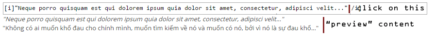

Date of creation: Jul 14, 2015. Last update: Jul 06, 2016.

I once put all of my phpBB extensions into one GitHub respository when I was a GitHub newbie. I am re-committing them for separate repositories.

# What is this?

A phpBB extension: COPY BBCode.

Tested on phpBB 3.1.9.

 `[copy]Click and then Ctrl + C to copy this text.[/copy]`
 
 is equivalent to:

`[code]Click and then Ctrl + C to copy this text.[/code]
Click and then Ctrl + C to copy this text.`

In my case, it is used for players to copy the BBCode of Character Profile without much effort (no scrolling quote), meanwhile the Game Master does not need to edit the Character Profile twice (one for the view, one for the copy BBCode) for every update he / she makes to the profile.

However, it does not auto-copy the content of BBCode, it only selects all of them.

# Example

Demo URL: http://forum.worwor.net/viewpost.php?p=410

The entire post in Edit mode looks like this:

`[copy][i]"Neque porro quisquam est qui dolorem ipsum quia dolor sit amet, consectetur, adipisci velit..."[/i]
"Không có ai muốn khổ đau cho chính mình, muốn tìm kiếm về nó và muốn có nó, bởi vì nó là sự đau khổ..."[/copy]`

